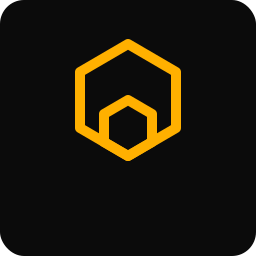

  

<h1 align="center">RogueFlow</h1>

  <i>Flow, Not Force.</i> 
  Lightweight automation framework for Rogue Piece

---

## Overview

RogueFlow is a minimal, performance-driven automation framework designed exclusively for Rogue Piece.

---

## Philosophy

Automation should flow — not fight the system.

---

## Status

Currently in active development.

---

## Disclaimer

Not affiliated with Roblox or Rogue Piece.
